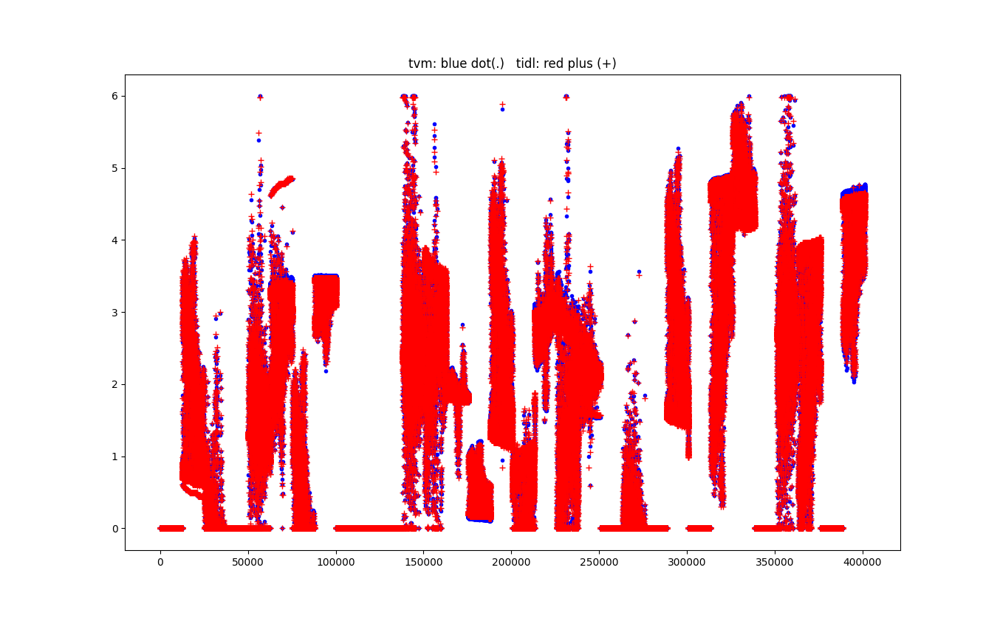

.. _ti-tvm-compiling:

=====================
Compilation Explained
=====================

This section explains TI TVM compilation in more detail. An introduction to this topic is provided in :ref:`ti-tvm-gs-compilation`.

.. _ti-tvm-compiling-env:

Environment Setup
=================
If they have not already been set up by Edgeai, the following three environment variables are required
before running the compilation script.

- ``TIDL_TOOLS_PATH``: Point to installed /processor_sdk_rtos/tidl_release/tidl_tools.
- ``ARM64_GCC_PATH``: Point to installed /gcc-arm-9.2-2019.12-x86_64-aarch64-none-linux-gnu.
- ``CGT7X_ROOT``: Point to installed TI C7x C/C++ compiler 4.1.0.LTS in the Processor SDK package or from `ti.com <https://www.ti.com/tool/download/C7000-CGT/>`_.

.. _ti-tvm-compiling-frontend:

Frontends
=========

TVM can accept machine learning models in many formats, including Tensorflow/TFLite, Keras,
Core ML, MXNet, ONNX, and PyTorch.  As the first step of compilation, these formats are all
imported into TVM's internal common representation, :term:`Relay IR`, using different frontends in TVM.

TI TVM provides additional examples beyond those provided by :term:`Apache TVM` in
``tests/python/relay/ti_tests/models.py`` to show how to import machine learning models in different network
formats into Relay IR.

.. _ti-tvm-compiling-calib:

Calibration Data
================

After partitioning layers into :term:`subgraphs` that can be offloaded to TIDL, these subgraphs need
to be imported to TIDL.  Because TIDL runs inference with quantized fixed-point values,
the TIDL import process requires calibration data so that each layer's dynamic range can be
estimated and the scaling factor for converting between floating point and fixed point
can be computed.

You only need to provide calibration data for the whole model. The TVM+TIDL compilation
flow automatically obtains the corresponding tensor values at the TIDL subgraph boundaries
and feeds those values into the TIDL import process for calibration.  The calibration
data you provide should represent typical input for the model.

Providing Calibration Data
---------------------------

Calibration data can be provided in two ways:

1. **Using Python API**: Pass calibration data directly when calling compilation functions
2. **Using TVMC with pickle file**: Create a pickle file containing calibration data and pass it via ``--target-tidl-calibration-data``

When using TVMC, prepare a pickle file with the following format:

.. code-block:: python

  import pickle
  import numpy as np

  # Create a list of calibration samples
  # Each sample is a dictionary mapping input names to numpy arrays
  graph_input_list = []
  for sample in calibration_samples:
      graph_input_list.append({
          'input': sample  # Replace 'input' with your model's input name
      })

  # Save to pickle file
  with open('calibration_data.pkl', 'wb') as f:
      pickle.dump(graph_input_list, f)

Then use it with TVMC:

.. code-block:: bash

  tvmc compile model.onnx \
      --target tidl \
      --target-tidl-platform am68a \
      --target-tidl-input-mean 123.675 116.28 103.53 \
      --target-tidl-input-scale 0.017125 0.017507 0.017429 \
      --target-tidl-enable-offload \
      --target-tidl-calibration-data ./calibration_data.pkl

.. _ti-tvm-compiling-artifacts:

Artifacts
=========

Deployable module
-----------------

After a successful TVM+TIDL compilation, a deployable module consists of 3 files that are saved in
the ``<artifacts_folder>``.

- **.json:** A JSON file describing the compiled graph through information about nodes, allocation, etc.
- **.so:** The shared library containing code to run nodes in the compiled graph.  This is a fat binary. Imported TIDL subgraph artifacts and generated C7x code are embedded in this fat binary.
- **.params:** Contains weights associated with the nodes in the compiled graph.

At inference time, DLR/TVM runtime read these 3 files and create a runtime instance to run
inference.

.. hint::
  During development, you may export the x86_64 Linux filesystem where you run compilation,
  and mount the filesystem on your EVM so that you do not need to copy the deployable module.

For deploying onto your EVM, the deployable module is all that is needed.  During compilation, TI TVM saves intermediate results in the ``<artifacts_folder>/tempDir`` directory.  These results may
help you understand and debug the compilation.  The following subsections describe some of the intermediate artifacts.

Relay graphs
------------

- **relay_graph.orig.txt:** The original relay graph from the TVM frontend.
- **relay_graph.prepared.txt:** The relay graph after transformations that prepare for TIDL offload.
- **relay_graph.annotated.txt:** The relay graph annotated for TIDL offload.
- **relay_graph.partitioned.txt:** The relay graph partitioned for TIDL offload.
- **relay_graph.import.txt:** The relay graph used to import into TIDL.
- **relay_graph.boundary.txt:** The relay graph used to obtain calibration data at TIDL subgraph boundaries.
- **relay_graph.optimized.txt:** The optimized relay graph for code generation.
- **relay_graph.wrapper.txt:** The wrapper relay graph on the Arm side for dispatching the graph to C7x.

For example, you may examine ``relay_graph.import.txt`` to see how many TIDL subgraphs are
created and which layers are not offloaded to TIDL.

Imported TIDL artifacts
-----------------------

TIDL subgraphs are imported into TIDL artifacts in TIDL-specific formats.  These artifacts are embedded into
the ``.so`` fat binary in the deployable module.  The DLR/TVM runtime retrieves TIDL artifacts
and invokes the TIDL runtime at inference time.

- **relay.gv.svg:** A graphical view of the whole network and where the TIDL subgraphs are located.
- **subgraph<n>_net.bin.svg:** A graphical view of TIDL subgraphs.

Generated C7x code
------------------

When ``c7x_codegen`` is set to 1 in the compilation script, TI TVM generates C7x code for layers
not offloaded to TIDL.  This C7x code is compiled and embedded into the ``.so`` fat binary in
the deployable module.  The DLR/TVM runtime retrieves the C7x code and dispatches it to the C7x
for execution.

- **model_<n>.c:** Contains generated code either to run a TIDL subgraph or non-TIDL layers.

.. _ti-tvm-compiling-debug:

Debugging Compilation
=====================

TI TVM uses the TIDL_RELAY_IMPORT_DEBUG environment variable to help debug the TVM+TIDL compilation flow. The available settings are as follows.

TIDL_RELAY_IMPORT_DEBUG=1
-------------------------

When set to 1, verbose output at the terminal provides more information about the TIDL import. This includes whether a node is supported by TIDL, relay node to TIDL node conversion, imported TIDL subgraphs,
optimized TIDL subgraphs, and calibration processes. For example:

.. code:: bash

  RelayImportDebug: In TIDL_relayAllowNode: 
  RelayImportDebug:   name: nn.conv2d
  RelayImportDebug: In TIDL_relayAllowNode: 
  RelayImportDebug:   name: nn.batch_norm

TIDL_RELAY_IMPORT_DEBUG=2, 3
----------------------------

When set to 2 or 3, verbose information about importing TIDL subgraphs is provided in addition to the information provided when the setting is 1.

TIDL_RELAY_IMPORT_DEBUG=4
-------------------------

When set to 4, the TIDL import generates output for each TIDL layer in the imported TIDL
subgraph using calibration inputs.  This output is stored in the auto-generated ``tempDir/tidl_import_subgraph<subgraph_id>.txt<layer_id><dimensions>_float.bin`` files.

The compilation also generates corresponding output from running the original model on
x86_64 hosts using TVM code generation for x86_64.  This is stored in the
``tempDir/tidl_<subgraph_id>_layer<layer_id>.npy`` files.

A script, ``python/tvm/contrib/tidl/compare_tensors.py`` is provided to compare the two
results with a graphical view. You can run the script as follows:

.. code:: bash

  # in tests/python/relay/ti_tests/
  TIDL_RELAY_IMPORT_DEBUG=4 python3 ./compile_model.py mv1_tf --target --tidl --c7x
  # compare_tensors.py <artifacts_folder> <subgraph_id> <layer_id>
  python3 $TVM_HOME/python/tvm/contrib/tidl/compare_tensors.py artifacts/mv1_tf_J7_target_tidl_c7x 0 2

