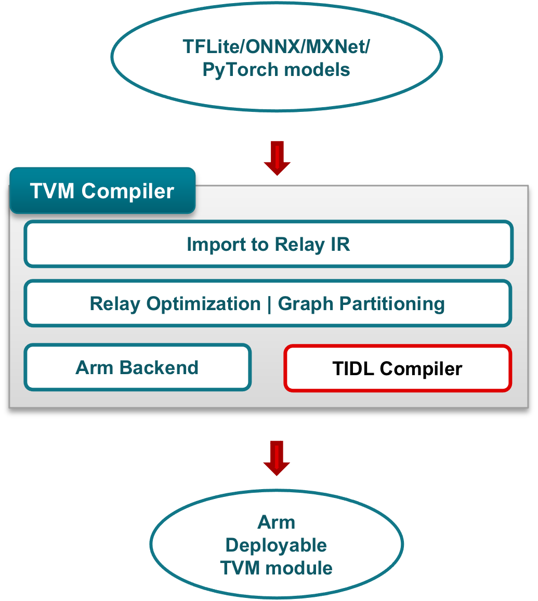
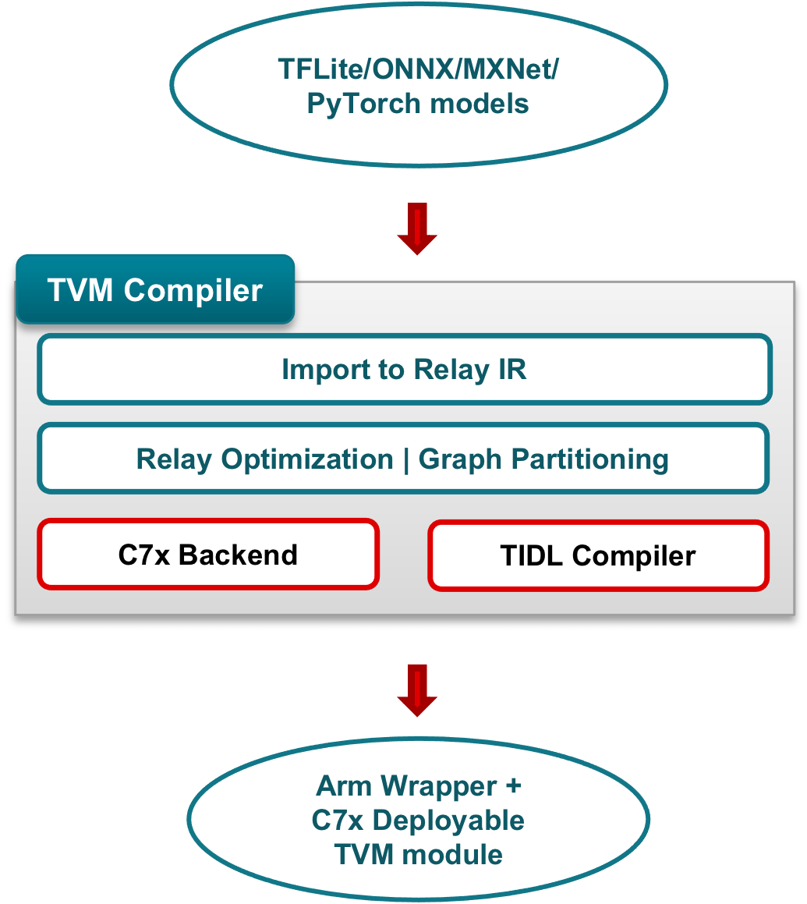

################
Compiling Models
################

TI TVM supports two options for compiling models with TIDL offload. The distinction is based on where layers unsupported
by TIDL are executed during inference:

#. Executing unsupported layers on Arm (See flow in :numref:`TVM Arm`)
#. Executing unsupported layers on C7x (See flow in :numref:`TVM C7x`). This option frees up the Arm
   for other aspects of the user application and can also improve overall inference performance by minimizing
   communication across the Arm and C7x.

.. _`TVM Arm`:

  Model compilation with unsupported layers mapped to Arm

.. _`TVM C7x`:

  Model compilation with unsupported layers mapped to C7x

Compiling for TIDL Offload
==========================

TVM compilation is typically done using a python compilation script.  We have example scripts
in `TI edgeai-tidl-tools <https://github.com/TexasInstruments/edgeai-tidl-tools/tree/master/examples/osrt_python/tvm_dlr>`_
and `TI TVM fork <https://github.com/TexasInstruments/tvm/tree/tidl-j7/tests/python/relay/ti_tests>`_
on Github.  Users can take these examples as template and modify for their own use case scenarios.
Overview of TI Open Source Runtime and compilation options are also in
`TI edgeai-tidl-tools overview <https://github.com/TexasInstruments/edgeai-tidl-tools/tree/master/examples/osrt_python>`_.

The following python functions are used in the examples we have in the TI TVM fork.

compile_model
-------------

The ``compile_model`` function encapsulates the steps required to compile a model with TIDL offload.

.. autofunction:: relay.ti_tests.compile_model.compile_model

:numref:`tidl-offload-overview` shows the key functions called from `compile_model`.

.. literalinclude:: ../../../tests/python/relay/ti_tests/compile_model.py
  :language: python
  :lines: 57-71
  :caption: Compiling a model with TIDL offload
  :name: tidl-offload-overview
  :linenos:

After a successful compile, the artifacts required to deploy the model are stored in the `artifacts_folder`.

compile_relay
-------------

The ``compile_relay`` function uses the TIDLCompiler class to partition the network and map subgraphs to TIDL.

.. autofunction:: tvm.contrib.tidl.compile.compile_relay

