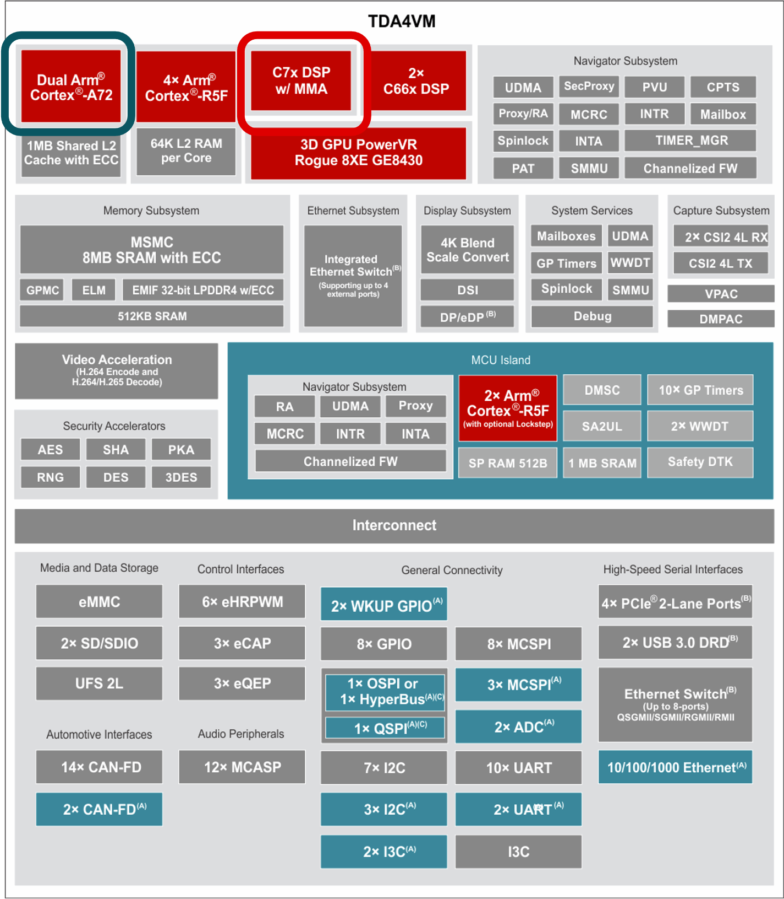

.. _ti-tvm-home:

###########################
TI TVM User's Guide - 8.6.x
###########################

Texas Instrument's fork of the Apache Tensor Virtual Machine (:term:`TVM`) enables support for the TDA4 family of processors. These processors use C7x DSPs and Matrix Multiplication Accelerators (:term:`MMA`) to accelerate :term:`inference`-making by machine learning models. For additional information about TDA4x processors and TI's Edge AI ecosystem, refer to the `Edge AI page on ti.com <https://www.ti.com/technologies/edge-ai.html>`_. 

The TI Deep Learning library (:term:`TIDL`) contains highly optimized implementations of common layers on C7x/MMA. 
If a model contains layers that are not implemented by TIDL, TVM can be used to run these layers on Arm (Cortex-A) cores 
or the C7x DSP core.

This user's guide documents the TI TVM Compiler and its usage.

.. toctree::
    :maxdepth: 1
    :hidden:
    :numbered:

    getting-started/index
    compiling
    infering
    developing
    extending
    building
    additional-docs
    glossary
    release-notes
    support
    Important Notice <notice>

.. extending

.. raw:: html

    For offline use, a PDF version of the guide is available here: <a href="https://software-dl.ti.com/codegen/docs/tvm/tvm_tidl_users_guide/TI_TVM_Users_Guide.pdf">TI TVM User's Guide</a>. 

.. |(R)| unicode:: U+00AE
    :ltrim:
