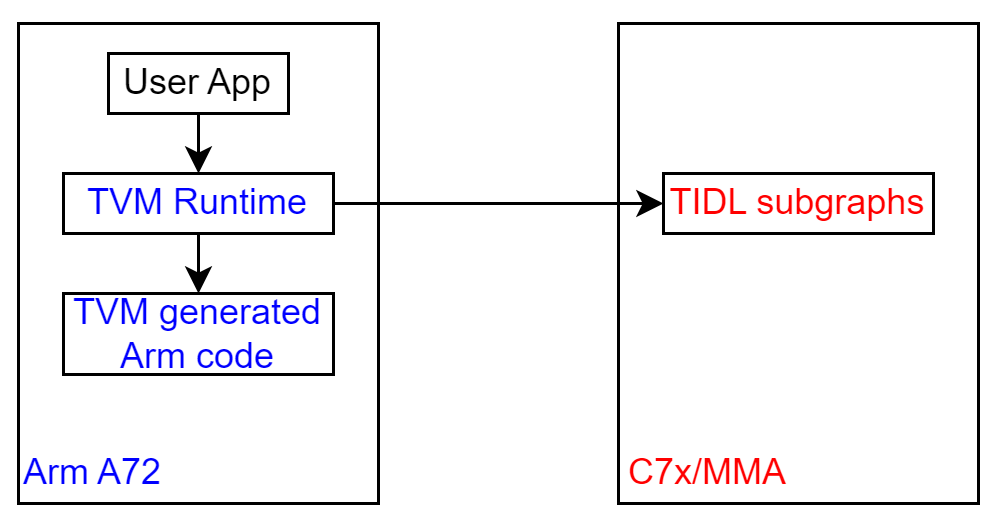
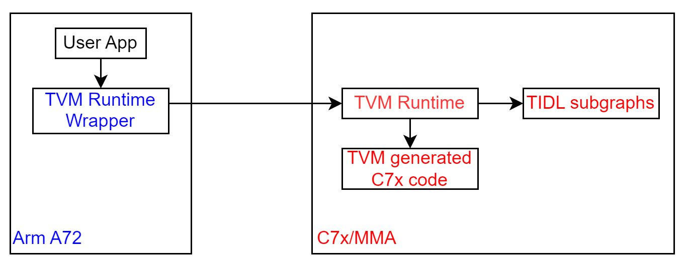

===================
Inference Explained
===================

In this section, we will explain in more details about TVM inference.

There are two inference scenarios, running TIDL unsupported layers on Arm or on C7x.  They
correspond to compiling the model with ``c7x_codegen=0`` or ``c7x_codegen=1``.  The same
inference script or application can be used for both scenarios.

Running unsupported layers on Arm
=================================

When running unsupported layers on Arm, TVM graph runtime on Arm will look at each node
in the graph (.json),

- If it is a TIDL subgraph, it is dispatched to C7x for execution (via OpenVX),
- If it is a non-TIDL node, it is executed with TVM generated Arm code.

.. _`TVM Infer Arm`:

  Model inference with unsupported layers mapped to Arm

Running unsupported layers on C7x
=================================

When running unsupported layers on C7x, TVM graph runtime on Arm will look at the single
node in the wrapper graph (.json), 'tidl_tvm_0', and dispatch the whole graph to C7x (via OpenVX).

TVM graph runtime at C7x will look at each node in the graph,

- If it is a TIDL subgraph, it is executed with TIDL library,
- If it is a non-TIDL node, it is executed with TVM generated C7x code.

.. _`TVM Infer C7x`:

  Model inference with unsupported layers mapped to C7x

Debugging Inference
===================

We use environment variable to help debug the TVM+TIDL inference flow.  First, we introduce the
"printf" terminal, where debug "printf" output from C7x core will show up.

Vision apps "printf" terminal
-----------------------------

Open a terminal on EVM, and run the following commands.  Run the inference in a different terminal.

.. code:: bash

  root@j7-evm:~# cd /opt/vision_apps/
  root@j7-evm:/opt/vision_apps# source ./vision_apps_init.sh

Debugging TIDL subgraphs
------------------------

TIDL_RT_DEBUG=1
^^^^^^^^^^^^^^^

When set, TIDL subgraph performance information are printed out during
inference, either on the "printf" terminal or on the terminal where inference is running.

.. code:: text

  [C7x_1 ] 1851913.287814 s:  Layer,   Layer Cycles,kernelOnlyCycles, coreLoopCycles,LayerSetupCycles,dmaPipeupCycles, dmaPipeDownCycles, PrefetchCycles,copyKerCoeffCycles,LayerDeinitCycles,LastBlockCycles, paddingTrigger,    paddingWait,LayerWithoutPad,LayerHandleCopy,   BackupCycles,  RestoreCycles,
  [C7x_1 ] 1851913.287889 s:      0,         201247,         171496,         173177,           1021,           9371,                20,              0,                 0,            375,          41487,           6392,             51,         191300,              0,              0,              0,
  [C7x_1 ] 1851913.287956 s:      1,          44208,          17603,          18221,           4170,           2679,                18,              0,                 0,            662,          17603,           7720,            454,          33530,           2096,              0,              0,
  ... ... ...

TIDL_RT_DEBUG=2, 3
^^^^^^^^^^^^^^^^^^

More verbose TIDL subgraph debug print outs.

.. code:: text

  [C7x_1 ] 1852081.872134 s: Alg Alloc for Layer # -    0
  [C7x_1 ] 1852081.872160 s: Alg Alloc for Layer # -    1
  ... ... ...
  [C7x_1 ] 1852081.873059 s: TIDL Memory requiement
  [C7x_1 ] 1852081.873087 s: MemRecNum , Space     , Attribute ,    SizeinBytes
  [C7x_1 ] 1852081.873117 s:  0         , DDR       , Persistent,    15208
  [C7x_1 ] 1852081.873145 s:  1         , DDR       , Persistent,    136
  ... ... ...
  [C7x_1 ] 1852081.874400 s: Alg Init for Layer # -    2 out of   32
  [C7x_1 ] 1852081.874470 s: Alg Init for Layer # -    3 out of   32
  ... ... ...
  [C7x_1 ] 1852081.911120 s: Starting Layer # -    1
  [C7x_1 ] 1852081.911145 s: Processing Layer # -    1
  [C7x_1 ] 1852081.911375 s: End of Layer # -    1 with outPtrs[0] = 7002001e
  [C7x_1 ] 1852081.911400 s: Starting Layer # -    2
  [C7x_1 ] 1852081.911422 s: Processing Layer # -    2
  [C7x_1 ] 1852081.911493 s: End of Layer # -    2 with outPtrs[0] = 7004550e
  ... ...

TIDL_RT_DEBUG=4, 5
^^^^^^^^^^^^^^^^^^

This is only supported when running TIDL unsupported layers on Arm.  When set, tensor output
from each layer in the TIDL subgraph are dumped into the Arm Linux file system, with names
``tidl_trace_subgraph_<subgraph_id>_<layer_id>_<tensor_shape>.y`` for raw data and
``tidl_trace_subgraph_<subgraph_id>_<layer_id>_<tensor_shape>_float.bin`` for converted float data.

Debugging TVM nodes
-------------------

TVM_RT_DEBUG=1
^^^^^^^^^^^^^^

When set, TVM runtime on Arm will collect performance statistics for each node
in the graph and save into the Arm Linux file system, with name ``tvm_arm.trace``.  You can use
``python/tvm/contrib/tidl/dump_tvm_trace.py`` to dump the details.

When TIDL unsupported layers are running on Arm, ``tvm_arm.trace`` will include execution time for
TIDL nodes and layers running on Arm.  E.g.

.. code:: console

  # python3 $TVM_HOME/python/tvm/contrib/tidl/dump_tvm_trace.py tvm_arm.trace
  Trace size: 633 version: 0x20220728 device: J7 core: Arm
  node 1: tidl_8  1520.9 microseconds
  node 2: tvmgen_default_fused_multiply  436.81 microseconds
  node 3: tidl_7  993.62 microseconds
  node 4: tvmgen_default_fused_multiply_1  149.11 microseconds
  node 5: tidl_6  1162.075 microseconds
  node 6: tvmgen_default_fused_multiply_11  176.68 microseconds
  node 7: tidl_5  2233.29 microseconds
  node 8: tvmgen_default_fused_multiply_2  120.095 microseconds
  node 9: tidl_4  1503.91 microseconds
  node 10: tvmgen_default_fused_multiply_3  163.83 microseconds
  node 11: tidl_3  1381.615 microseconds
  node 12: tvmgen_default_fused_multiply_4  61.94 microseconds
  node 13: tidl_2  1195.17 microseconds
  node 14: tvmgen_default_fused_multiply_5  70.53 microseconds
  node 15: tidl_1  1311.9 microseconds
  node 16: tvmgen_default_fused_multiply_51  71.32 microseconds
  node 17: tidl_0  1279.285 microseconds
  node 4294967295: Graph  13856.93 microseconds

When TIDL unsupported layers are running on C7x, ``tvm_arm.trace`` will only include execution
time for a single node representing the whole graph.  E.g.

.. code:: console

  # python3 $TVM_HOME/python/tvm/contrib/tidl/dump_tvm_trace.py tvm_arm.trace
  Trace size: 69 version: 0x20220728 device: J7 core: Arm
  node 1: tidl_tvm_0  9126.275 microseconds
  node 4294967295: Graph  9129.92 microseconds

TVM_RT_DEBUG=2
^^^^^^^^^^^^^^

When set, in addition to ``TVM_RT_DEBUG=1``, TVM runtime on C7x will also collect performance
statistics for each node in the graph on C7x and save into the Arm Linux file system,
with name ``tvm_c7x.trace``.  You can use ``python/tvm/contrib/tidl/dump_tvm_trace.py``
to dump the details. 

.. code:: console

  # python3 $TVM_HOME/python/tvm/contrib/tidl/dump_tvm_trace.py tvm_c7x.trace
  Trace size: 631 version: 0x20220728 device: J7 core: C7x
  node 1: tidl_8  909.002 microseconds
  node 2: tvmgen_default_fused_multiply  62.201 microseconds
  node 3: tidl_7  378.24 microseconds
  node 4: tvmgen_default_fused_multiply_1  83.055 microseconds
  node 5: tidl_6  445.359 microseconds
  node 6: tvmgen_default_fused_multiply_1  83.433 microseconds
  node 7: tidl_5  1590.525 microseconds
  node 8: tvmgen_default_fused_multiply_2  82.979 microseconds
  node 9: tidl_4  809.138 microseconds
  node 10: tvmgen_default_fused_multiply_3  110.202 microseconds
  node 11: tidl_3  802.037 microseconds
  node 12: tvmgen_default_fused_multiply_4  46.95 microseconds
  node 13: tidl_2  848.143 microseconds
  node 14: tvmgen_default_fused_multiply_5  55.662 microseconds
  node 15: tidl_1  908.129 microseconds
  node 16: tvmgen_default_fused_multiply_5  54.628 microseconds
  node 17: tidl_0  990.953 microseconds
  node 4294967295: Graph  8283.967 microseconds

``tvm_c7x.trace`` is only available for the model compiled with ``c7x_codegen=1``. 

TVM_RT_DEBUG=3
^^^^^^^^^^^^^^

When set, in addition to behavior ``TVM_RT_DEBUG=1,2``, TVM runtime on Arm and C7x will also
collect output tensor statistics for each layer and save into the trace files.  Collected
statistics  include minimum, maximum, sum, sum of the first half of the tensor.
Please ignore the performance numbers in this mode as there are overhead collecting tensor
statistics.

.. code:: console

  # python3 $TVM_HOME/python/tvm/contrib/tidl/dump_tvm_trace.py tvm_arm.trace
  Trace size: 1833 version: 0x20220728 device: J7 core: Arm
  node 1: tidl_8  1527.845 microseconds
    output 0: ndim=4 type_code=2 elem_bytes=4 num_elements=56448
             min=0.0 max=21.715360641479492 sum=234286.71875 fh_sum=110520.9296875
    output 1: ndim=4 type_code=2 elem_bytes=4 num_elements=72
             min=0.73150634765625 max=0.999969482421875 sum=68.35482788085938 fh_sum=34.87158203125
  node 2: tvmgen_default_fused_multiply  416.19 microseconds
    output 0: ndim=4 type_code=2 elem_bytes=4 num_elements=56448
             min=0.0 max=21.439014434814453 sum=226814.515625 fh_sum=106811.2890625
  ... ... ...

.. code:: console

  # python3 $TVM_HOME/python/tvm/contrib/tidl/dump_tvm_trace.py tvm_c7x.trace
  Trace size: 1831 version: 0x20220728 device: J7 core: C7x
  node 1: tidl_8  934.738 microseconds
    output 0: ndim=4 type_code=2 elem_bytes=4 num_elements=56448
             min=0.0 max=21.715360641479492 sum=234286.71875 fh_sum=110520.9296875
    output 1: ndim=4 type_code=2 elem_bytes=4 num_elements=72
             min=0.73150634765625 max=0.999969482421875 sum=68.35482788085938 fh_sum=34.87158203125
  node 2: tvmgen_default_fused_multiply  64.704 microseconds
    output 0: ndim=4 type_code=2 elem_bytes=4 num_elements=56448
             min=0.0 max=21.439014434814453 sum=226814.515625 fh_sum=106811.2890625
  ... ... ...

TVM_RT_DEBUG=4
^^^^^^^^^^^^^^

When set, TVM runtime on Arm and C7x will print out information about each node when each node
is being executed, either on the terminal where inference is run or the "printf" terminal.
This mode can be helpful to debug the model execution.

TVM_RT_TRACE_NODE=<node_id> TVM_RT_DEBUG=3, 4
^^^^^^^^^^^^^^^^^^^^^^^^^^^^^^^^^^^^^^^^^^^^^

When set, TVM runtime on Arm and C7x will also save the tensor outputs of the specified node into
the trace file.  ``dump_trace.py`` will save the tensor outputs into the Arm Linux file system
as numpy files, with name ``n<node_id>_o<output_id>.npy``.  Node the ``tensor values saved in``
lines in the following example.  Tensor outputs are saved as float values in the trace.

.. code:: console

  # TVM_RT_TRACE_NODE=1 TVM_RT_DEBUG=4 python3 ./infer_model.py ... ... 
  ... ...
  # python3 $TVM_HOME/python/tvm/contrib/tidl/dump_tvm_trace.py tvm_c7x.trace
  Trace size: 227911 version: 0x20220728 device: J7 core: C7x
  node 1: tidl_8  912.196 microseconds
    output 0: ndim=4 type_code=2 elem_bytes=4 num_elements=56448
             min=0.0 max=21.715360641479492 sum=234286.71875 fh_sum=110520.9296875
             tensor values saved in n1_o0.npy
    output 1: ndim=4 type_code=2 elem_bytes=4 num_elements=72
             min=0.73150634765625 max=0.999969482421875 sum=68.35482788085938 fh_sum=34.87158203125
             tensor values saved in n1_o1.npy
  node 2: tvmgen_default_fused_multiply  65.955 microseconds
    output 0: ndim=4 type_code=2 elem_bytes=4 num_elements=56448
             min=0.0 max=21.439014434814453 sum=226814.515625 fh_sum=106811.2890625
  node 3: tidl_7  388.9 microseconds

TVM_RT_TRACE_SIZE=<new_size> TVM_TRACE_NODE=<node_id> TVM_RT_DEBUG=3, 4
^^^^^^^^^^^^^^^^^^^^^^^^^^^^^^^^^^^^^^^^^^^^^^^^^^^^^^^^^^^^^^^^^^^^^^^

If you see ``Not enough trace memory for dumping output <node_id>`` message in the verbose
output for a node, you can use ``TVM_RT_TRACE_SIZE`` to set a larger trace buffer to store
the trace.  The default is set to 2*1024*1024 (2MB) bytes.
